# Diagrama de Arquitectura - Movie Catalog API

## Arquitectura del Sistema NestJS

```mermaid
graph TB
    %% Client Layer
    Client[🌐 Frontend Client<br/>Web/Mobile App]
    
    %% API Gateway Layer
    subgraph "NestJS Application"
        direction TB
        
        %% API Entry Point
        Main[📋 main.ts<br/>Bootstrap & Config]
        Swagger[📚 Swagger Docs<br/>/api/docs]
        
        %% Core Modules
        subgraph "Core API Modules"
            AppModule[🏠 App Module<br/>Main Application]
            HealthModule[💊 Health Module<br/>Health Checks]
        end
        
        %% Business Modules
        subgraph "Business Logic Modules"
            MoviesModule[🎬 Movies Module<br/>CRUD Operations]
            GenresModule[🎭 Genres Module<br/>CRUD Operations]
            DirectorsModule[🎯 Directors Module<br/>CRUD Operations]
        end
        
        %% Shared Services
        subgraph "Shared Services (Common Module)"
            CacheService[⚡ Cache Service<br/>Redis Management]
            UploadService[📁 Upload Service<br/>File Management]
            ValidationInt[🛡️ File Validation<br/>Interceptor]
            HttpFilter[🚨 HTTP Exception<br/>Filter]
            LoggerMid[📝 Logger<br/>Middleware]
        end
        
        %% Database Layer
        subgraph "Database Layer"
            DatabaseModule[🗄️ Database Module<br/>TypeORM Config]
            SeedService[🌱 Seed Service<br/>Initial Data]
        end
    end
    
    %% External Services
    subgraph "Data Storage"
        PostgreSQL[(🐘 PostgreSQL<br/>Primary Database<br/>Movies, Genres, Directors)]
        Redis[(🔴 Redis<br/>Cache Layer<br/>Performance)]
    end
    
    %% File Storage
    subgraph "File Storage"
        LocalStorage[📂 Local Storage<br/>uploads/ directory<br/>Development]
        S3Storage[☁️ AWS S3<br/>Cloud Storage<br/>Production]
    end
    
    %% Environment Config
    EnvConfig[⚙️ Environment Config<br/>.env / .env.prod]
    
    %% Client Connections
    Client -->|HTTP REST API<br/>api/v1/*| Main
    Client -->|View Documentation| Swagger
    
    %% Internal App Flow
    Main --> AppModule
    AppModule --> HealthModule
    AppModule --> MoviesModule
    AppModule --> GenresModule
    AppModule --> DirectorsModule
    AppModule --> DatabaseModule
    
    %% Shared Services Connections
    MoviesModule --> CacheService
    GenresModule --> CacheService
    DirectorsModule --> CacheService
    MoviesModule --> UploadService
    
    %% Middleware & Filters
    Main --> HttpFilter
    Main --> LoggerMid
    UploadService --> ValidationInt
    
    %% Database Connections
    DatabaseModule --> PostgreSQL
    SeedService --> PostgreSQL
    MoviesModule --> PostgreSQL
    GenresModule --> PostgreSQL
    DirectorsModule --> PostgreSQL
    
    %% Cache Connections
    CacheService --> Redis
    
    %% File Storage Connections
    UploadService -->|Development| LocalStorage
    UploadService -->|Production| S3Storage
    
    %% Configuration
    EnvConfig --> Main
    EnvConfig --> DatabaseModule
    EnvConfig --> CacheService
    EnvConfig --> UploadService
    
    %% Styling
    classDef clientStyle fill:#e1f5fe,stroke:#01579b,stroke-width:2px
    classDef moduleStyle fill:#f3e5f5,stroke:#4a148c,stroke-width:2px
    classDef serviceStyle fill:#e8f5e8,stroke:#1b5e20,stroke-width:2px
    classDef storageStyle fill:#fff3e0,stroke:#e65100,stroke-width:2px
    classDef configStyle fill:#fce4ec,stroke:#880e4f,stroke-width:2px
    
    class Client clientStyle
    class AppModule,HealthModule,MoviesModule,GenresModule,DirectorsModule,DatabaseModule moduleStyle
    class CacheService,UploadService,ValidationInt,HttpFilter,LoggerMid,SeedService serviceStyle
    class PostgreSQL,Redis,LocalStorage,S3Storage storageStyle
    class EnvConfig,Main,Swagger configStyle
```

## Descripción de Componentes

### 🌐 **Frontend Client**
- Aplicaciones web o móviles que consumen la API REST
- Comunicación HTTP con endpoints `/api/v1/*`
- Acceso a documentación Swagger en `/api/docs`

### 🏗️ **NestJS Application**

#### **Core API Modules**
- **App Module**: Módulo principal que orquesta toda la aplicación
- **Health Module**: Endpoints para health checks y monitoring

#### **Business Logic Modules**
- **Movies Module**: CRUD completo para películas + endpoints especiales (populares, búsqueda)
- **Genres Module**: Gestión de géneros cinematográficos
- **Directors Module**: Gestión de directores

#### **Shared Services (Common Module)**
- **Cache Service**: Gestión de Redis con invalidación inteligente
- **Upload Service**: Manejo de archivos (local/S3 según ambiente)
- **File Validation Interceptor**: Validación de tipos y tamaños de archivo
- **HTTP Exception Filter**: Manejo global de errores
- **Logger Middleware**: Logging de todas las requests

#### **Database Layer**
- **Database Module**: Configuración TypeORM y conexión PostgreSQL
- **Seed Service**: Poblado automático de datos iniciales

### 💾 **Data Storage**
- **PostgreSQL**: Base de datos principal (movies, genres, directors)
- **Redis**: Cache layer para optimización de performance

### 📁 **File Storage**
- **Local Storage**: Directorio `uploads/` para desarrollo
- **AWS S3**: Almacenamiento en la nube para producción

### ⚙️ **Configuration**
- Variables de entorno (`.env`, `.env.prod`)
- Configuración de todos los servicios y conexiones

## Flujos de Datos

1. **Client → API**: HTTP REST calls
2. **API → PostgreSQL**: Operaciones CRUD via TypeORM
3. **API → Redis**: Cache read/write/invalidation
4. **API → Storage**: Upload de posters de películas
5. **Config → Services**: Inyección de configuración de entorno

## Características Técnicas

- 🚀 **Auto-seeding** al iniciar la aplicación
- ⚡ **Redis caching** con TTL y invalidación
- 📁 **Dual storage strategy** (desarrollo/producción)
- 🛡️ **Security & Validation** en todos los niveles
- 📚 **API Documentation** automática con Swagger
- 🔄 **Health monitoring** integrado
- 🐳 **Docker containerization** completa 