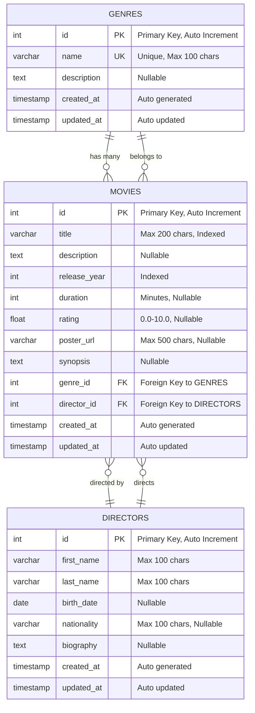

# Database Entity-Relationship Diagram

Este diagrama muestra el esquema de la base de datos del proyecto Movie Catalog, incluyendo todas las entidades, atributos, tipos de datos y relaciones.

## Diagrama ER



## Descripción de Entidades

### 🎬 MOVIES (Entidad Principal)
**Tabla**: `movies`

| Campo | Tipo | Constraints | Descripción |
|-------|------|-------------|-------------|
| `id` | `int` | **PK**, Auto Increment | Identificador único de la película |
| `title` | `varchar(200)` | **NOT NULL**, **Indexed** | Título de la película |
| `description` | `text` | Nullable | Descripción breve de la película |
| `release_year` | `int` | **NOT NULL**, **Indexed** | Año de lanzamiento |
| `duration` | `int` | Nullable | Duración en minutos |
| `rating` | `float` | Nullable | Calificación de 0.0 a 10.0 |
| `poster_url` | `varchar(500)` | Nullable | URL del póster de la película |
| `synopsis` | `text` | Nullable | Sinopsis detallada |
| `genre_id` | `int` | **FK** → GENRES(id) | Relación con género |
| `director_id` | `int` | **FK** → DIRECTORS(id) | Relación con director |
| `created_at` | `timestamp` | Auto generated | Fecha de creación |
| `updated_at` | `timestamp` | Auto updated | Fecha de última actualización |

**Índices**:
- `title` - Para búsquedas por título
- `release_year` - Para filtrado por año

**Relaciones**:
- **Many-to-One** con GENRES (una película pertenece a un género)
- **Many-to-One** con DIRECTORS (una película es dirigida por un director)

### 🎭 GENRES (Catálogo de Géneros)
**Tabla**: `genres`

| Campo | Tipo | Constraints | Descripción |
|-------|------|-------------|-------------|
| `id` | `int` | **PK**, Auto Increment | Identificador único del género |
| `name` | `varchar(100)` | **NOT NULL**, **UNIQUE** | Nombre del género |
| `description` | `text` | Nullable | Descripción del género |
| `created_at` | `timestamp` | Auto generated | Fecha de creación |
| `updated_at` | `timestamp` | Auto updated | Fecha de última actualización |

**Constraints**:
- `name` debe ser único en toda la tabla

**Relaciones**:
- **One-to-Many** con MOVIES (un género puede tener muchas películas)

### 🎯 DIRECTORS (Catálogo de Directores)
**Tabla**: `directors`

| Campo | Tipo | Constraints | Descripción |
|-------|------|-------------|-------------|
| `id` | `int` | **PK**, Auto Increment | Identificador único del director |
| `first_name` | `varchar(100)` | **NOT NULL** | Nombre del director |
| `last_name` | `varchar(100)` | **NOT NULL** | Apellido del director |
| `birth_date` | `date` | Nullable | Fecha de nacimiento |
| `nationality` | `varchar(100)` | Nullable | Nacionalidad |
| `biography` | `text` | Nullable | Biografía del director |
| `created_at` | `timestamp` | Auto generated | Fecha de creación |
| `updated_at` | `timestamp` | Auto updated | Fecha de última actualización |

**Propiedades Virtuales**:
- `fullName` - Concatenación de `first_name` + `last_name`

**Relaciones**:
- **One-to-Many** con MOVIES (un director puede dirigir muchas películas)

## Relaciones Detalladas

### 🔗 MOVIES ← → GENRES
- **Tipo**: Many-to-One (Muchas películas, un género)
- **Cardinalidad**: `MOVIES.genre_id` → `GENRES.id`
- **Eager Loading**: ✅ (TypeORM)
- **Descripción**: Cada película pertenece a exactamente un género, pero un género puede clasificar múltiples películas

### 🔗 MOVIES ← → DIRECTORS  
- **Tipo**: Many-to-One (Muchas películas, un director)
- **Cardinalidad**: `MOVIES.director_id` → `DIRECTORS.id`
- **Eager Loading**: ✅ (TypeORM)
- **Descripción**: Cada película es dirigida por exactamente un director, pero un director puede dirigir múltiples películas

## Ejemplos de Datos

### Género de Ejemplo
```json
{
  "id": 1,
  "name": "Science Fiction",
  "description": "Movies that explore futuristic concepts, advanced science and technology, space exploration, time travel, parallel universes, and extraterrestrial life.",
  "createdAt": "2024-01-15T10:00:00.000Z",
  "updatedAt": "2024-01-15T10:00:00.000Z"
}
```

### Director de Ejemplo
```json
{
  "id": 1,
  "firstName": "Christopher",
  "lastName": "Nolan",
  "birthDate": "1970-07-30",
  "nationality": "British",
  "biography": "Christopher Nolan is a British-American film director, producer, and screenwriter known for his films that explore themes of time, memory, and reality.",
  "fullName": "Christopher Nolan",
  "createdAt": "2024-01-15T10:00:00.000Z",
  "updatedAt": "2024-01-15T10:00:00.000Z"
}
```

### Película de Ejemplo
```json
{
  "id": 1,
  "title": "The Matrix",
  "description": "A computer hacker learns from mysterious rebels about the true nature of his reality and his role in the war against its controllers.",
  "releaseYear": 1999,
  "duration": 136,
  "rating": 8.7,
  "posterUrl": "/uploads/posters/poster-123.jpg",
  "synopsis": "Neo (Keanu Reeves) believes that Morpheus (Laurence Fishburne), an elusive figure considered to be the most dangerous man alive, can answer his question -- What is the Matrix?",
  "genre": { "id": 1, "name": "Science Fiction" },
  "director": { "id": 1, "firstName": "Christopher", "lastName": "Nolan" },
  "createdAt": "2024-01-15T10:00:00.000Z",
  "updatedAt": "2024-01-15T10:00:00.000Z"
}
```

## Configuración de TypeORM

### Entidades Configuradas
- ✅ **Movie** - Entidad principal con relaciones eager
- ✅ **Genre** - Catálogo con constraint único
- ✅ **Director** - Catálogo con propiedad virtual

### Características Implementadas
- 🔒 **Foreign Key Constraints** - Integridad referencial
- 📈 **Índices** - Optimización de consultas (title, releaseYear)
- ⚡ **Eager Loading** - Carga automática de relaciones
- 🕒 **Timestamps** - Auditoría automática (createdAt, updatedAt)
- 🔍 **Unique Constraints** - Evita duplicados (genre.name)

### Migraciones Automáticas
La configuración de TypeORM con `synchronize: true` en desarrollo permite:
- Creación automática de tablas
- Actualización automática del esquema
- Generación de índices y constraints

## Consultas Comunes

### Buscar películas por género
```sql
SELECT m.*, g.name as genre_name 
FROM movies m 
JOIN genres g ON m.genre_id = g.id 
WHERE g.name = 'Science Fiction';
```

### Buscar películas por director
```sql
SELECT m.*, d.first_name, d.last_name 
FROM movies m 
JOIN directors d ON m.director_id = d.id 
WHERE d.first_name = 'Christopher' AND d.last_name = 'Nolan';
```

### Películas populares (rating >= 8.0)
```sql
SELECT * FROM movies 
WHERE rating >= 8.0 
ORDER BY rating DESC;
```

### Contar películas por género
```sql
SELECT g.name, COUNT(m.id) as movie_count 
FROM genres g 
LEFT JOIN movies m ON g.id = m.genre_id 
GROUP BY g.id, g.name;
```

---

*Este diagrama refleja el esquema actual de la base de datos basado en las entidades TypeORM definidas en el proyecto* 