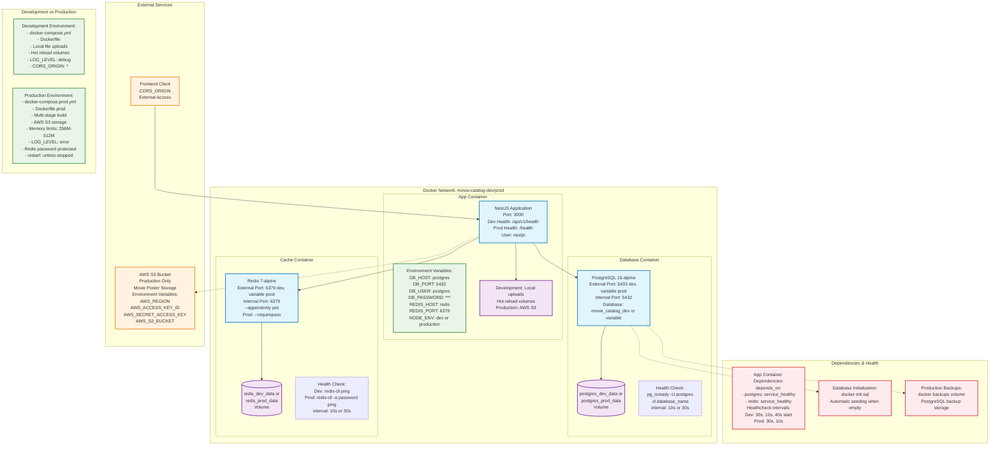

# Docker Containers Architecture Diagram

Este diagrama muestra la arquitectura de contenedores Docker para el proyecto Movie Catalog, incluyendo las diferencias entre los entornos de desarrollo y producción.

## Diagrama de Contenedores



## Descripción de Componentes

### Contenedores Principales

#### 🔵 App Container (NestJS)
- **Imagen**: Node.js LTS Alpine
- **Puerto**: 3000
- **Usuario**: nestjs (seguridad)
- **Healthcheck**: 
  - Desarrollo: `/api/v1/health` (30s interval, 10s timeout, 40s start period)
  - Producción: `/health` (30s interval, 10s timeout)
- **Configuración**:
  - Desarrollo: Hot reload con volúmenes montados
  - Producción: Multi-stage build, límites de memoria (256M-512M)

#### 🔵 Database Container (PostgreSQL)
- **Imagen**: postgres:15-alpine
- **Puerto**: 
  - Desarrollo: 5433:5432
  - Producción: variable:5432
- **Base de datos**: 
  - Desarrollo: `movie_catalog_dev`
  - Producción: variable
- **Healthcheck**: `pg_isready -U postgres -d database_name`
- **Características**:
  - Inicialización automática con `docker/init.sql`
  - Backups en producción (`docker/backups`)

#### 🔵 Cache Container (Redis)
- **Imagen**: redis:7-alpine
- **Puerto**: 6379
- **Configuración**:
  - AOF (Append Only File) habilitado
  - Desarrollo: Sin autenticación
  - Producción: Protegido con password
- **Healthcheck**: 
  - Desarrollo: `redis-cli ping`
  - Producción: `redis-cli -a password ping`

### 🟣 Volúmenes Persistentes

- **postgres_dev_data / postgres_prod_data**: Datos de PostgreSQL
- **redis_dev_data / redis_prod_data**: Datos de Redis
- **app_node_modules**: Node modules (solo desarrollo)

### 🟠 Servicios Externos

#### AWS S3 (Solo Producción)
- Almacenamiento de imágenes de pósters
- Variables de entorno: `AWS_REGION`, `AWS_ACCESS_KEY_ID`, `AWS_SECRET_ACCESS_KEY`, `AWS_S3_BUCKET`

#### Frontend Client
- Acceso externo a la API
- Configuración de CORS según entorno

### 🟢 Variables de Entorno

#### Desarrollo
```env
DB_HOST=postgres
DB_PORT=5432
DB_USER=postgres
DB_PASSWORD=dev_password_123
DB_NAME=movie_catalog_dev
REDIS_HOST=redis
REDIS_PORT=6379
NODE_ENV=development
CORS_ORIGIN=*
LOG_LEVEL=debug
```

#### Producción
```env
DB_HOST=postgres
DB_PORT=5432
DB_USER=${DB_USER}
DB_PASSWORD=${DB_PASSWORD}
DB_NAME=${DB_NAME}
REDIS_HOST=redis
REDIS_PORT=6379
REDIS_PASSWORD=${REDIS_PASSWORD}
NODE_ENV=production
CORS_ORIGIN=${CORS_ORIGIN}
LOG_LEVEL=error
AWS_REGION=${AWS_REGION}
AWS_ACCESS_KEY_ID=${AWS_ACCESS_KEY_ID}
AWS_SECRET_ACCESS_KEY=${AWS_SECRET_ACCESS_KEY}
AWS_S3_BUCKET=${AWS_S3_BUCKET}
```

### 🔴 Dependencias y Salud

#### App Dependencies
- **depends_on**: 
  - `postgres`: `service_healthy`
  - `redis`: `service_healthy`
- El contenedor de la aplicación no se inicia hasta que PostgreSQL y Redis estén completamente saludables

#### Health Checks
- **PostgreSQL**: Verifica conexión cada 10s (dev) o 30s (prod)
- **Redis**: Verifica conectividad cada 10s (dev) o 30s (prod)
- **App**: Verifica endpoint de salud cada 30s

## Diferencias Clave: Desarrollo vs Producción

| Aspecto | Desarrollo | Producción |
|---------|------------|------------|
| **Dockerfile** | `Dockerfile` | `Dockerfile.prod` |
| **Compose** | `docker-compose.yml` | `docker-compose.prod.yml` |
| **Build** | Single-stage, todas las dependencias | Multi-stage, solo producción |
| **Storage** | Local (`uploads/`) | AWS S3 |
| **Redis** | Sin password | Con password |
| **Logs** | `debug` | `error` |
| **CORS** | `*` (todos los orígenes) | Específico |
| **Restart** | `always` | `unless-stopped` |
| **Memory** | Sin límites | 256M-512M |
| **Hot Reload** | ✅ Volúmenes montados | ❌ Build estático |
| **Backups** | ❌ | ✅ Volumen de backups |

## Comandos de Uso

### Desarrollo
```bash
# Iniciar todos los servicios
make dev

# Ver logs
make logs

# Parar servicios
make down
```

### Producción
```bash
# Iniciar servicios de producción
make prod

# Ver logs de producción
make logs-prod

# Parar servicios de producción
make down-prod
```

---

*Este diagrama refleja la configuración actual de Docker basada en `docker-compose.yml` y `docker-compose.prod.yml`* 